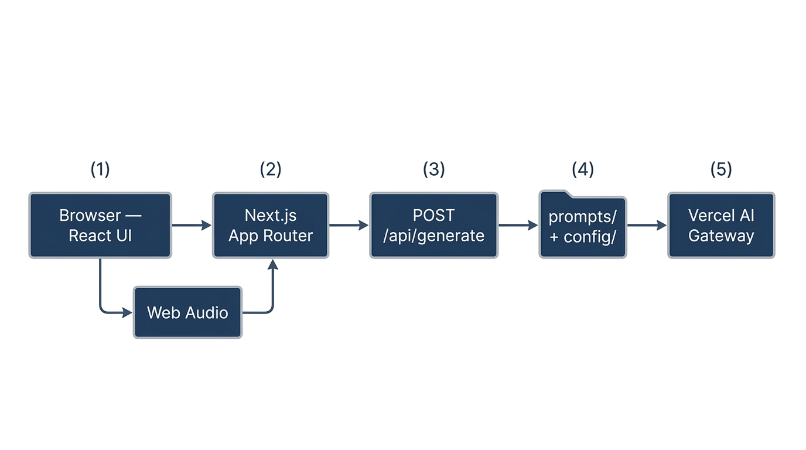
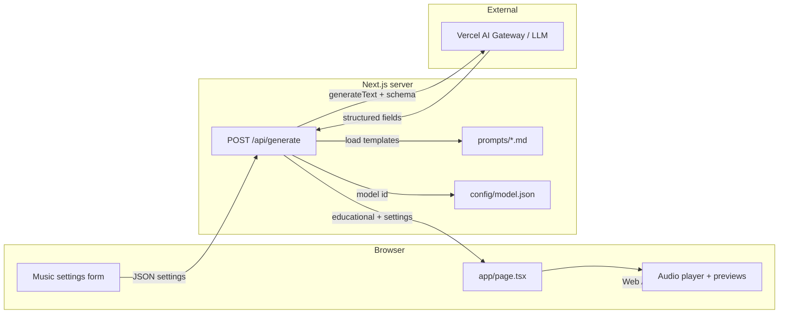

# Architecture — Sonic Scholar

## Overview

Sonic Scholar is a **music education** web app: users configure a synthetic track, request an **AI-generated educational breakdown**, and preview **browser-generated audio** (Web Audio API). Deployment targets **Vercel** and the **Next.js App Router**.

## Tech stack

| Layer | Technology |
|-------|------------|
| Framework | **Next.js 16** (App Router, Turbopack in dev) |
| Language | **TypeScript** |
| UI | **React 19**, **Tailwind CSS** v4, **Radix UI** primitives |
| AI | **Vercel AI SDK** (`ai`), `generateText` with **structured output** (Zod). Model id from **`config/model.json`** (default `openai/gpt-4o-mini`), routed via **Vercel AI Gateway** when deployed. |
| Validation | **Zod** |
| Analytics | **@vercel/analytics** (production) |

## Data flow (text)

1. **Client** sends `MusicSettings` to `/api/generate`.
2. **`app/api/generate/route.ts`** loads system + user templates from **`prompts/`**, substitutes variables, reads **`getGenerateTextModelId()`** from `config/model.json`, calls **`generateText`** with a Zod object schema.
3. **Success:** JSON includes `educational` and `settings`.
4. **Failure:** Gateway billing may yield **403**; other failures return **200** with a **fallback** `educational` and `warning`.
5. **Audio** is synthesized **client-side** (`lib/soundscape-engine.ts`, `lib/preview-*.ts`); optional clips under `public/assets/audio/`.

## Key directories

| Path | Role |
|------|------|
| `app/` | Routes, layout, styles |
| `prompts/` | LLM system + user templates (server-loaded) |
| `config/` | Model id (`model.json`), data-connector notes |
| `components/` | UI |
| `lib/` | Audio, prompt loading, model config |
| `docs/` | Architecture, use cases, telemetry, safety |
| `tests/` | Vitest smoke tests |
| `public/assets/audio/` | Optional preview samples |

## Security

- Templates are read **only on the server** (`fs.readFileSync`).
- User **prompt** text is **untrusted** input in the user message; see [safety-and-privacy.md](./safety-and-privacy.md).

## Related docs

- [use-cases.md](./use-cases.md)  
- [telemetry.md](./telemetry.md)  
- [INSTALL.md](../INSTALL.md)  
