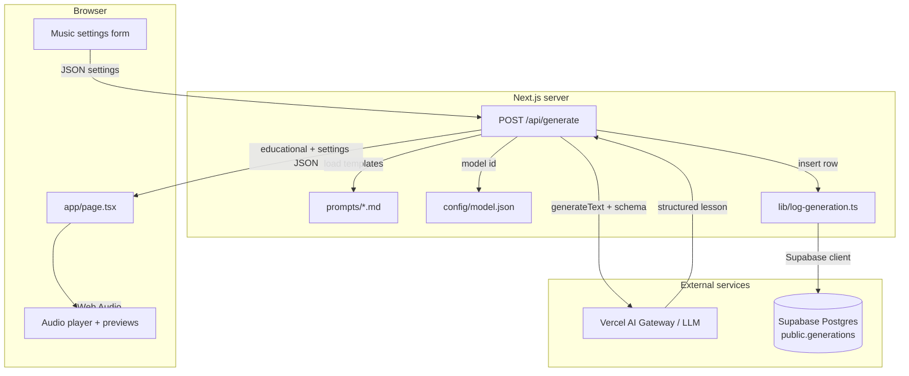

# Architecture — BeatAI

## Overview

BeatAI is a **music education** web app: users configure a synthetic track, request an **AI-generated educational breakdown**, preview **browser-generated audio** (Web Audio API), and each successful generation is **persisted** to **Supabase Postgres** (`public.generations`). Deployment targets **Vercel** and the **Next.js App Router**.

## Tech stack

| Layer | Technology |
|-------|------------|
| Framework | **Next.js 16** (App Router, Turbopack in dev) |
| Language | **TypeScript** |
| UI | **React 19**, **Tailwind CSS** v4, **Radix UI** primitives |
| AI | **Vercel AI SDK** (`ai`), `generateText` with **structured output** (Zod). Model id from **`config/model.json`** (default `openai/gpt-4o-mini`), routed via **Vercel AI Gateway** when deployed. |
| Validation | **Zod** |
| Analytics | **@vercel/analytics** (production) |
| Database | **Supabase** (PostgreSQL) — `@supabase/supabase-js`, server-side inserts via `lib/supabaseServer.ts` + `lib/log-generation.ts` |

## Data flow (text)

1. **Client** sends `MusicSettings` to `/api/generate`.
2. **`app/api/generate/route.ts`** loads system + user templates from **`prompts/`**, reads **`config/model.json`** via `getGenerateTextModelId()`, calls **`generateText`** with a Zod object schema.
3. **Success or fallback:** JSON includes `educational` and `settings`; **`insertGenerationServer`** writes one row to **`generations`** (inputs + five lesson text columns).
4. **Failure paths:** Gateway billing may yield **403**; other AI errors return **200** with a **fallback** `educational` — a row is still inserted when that path runs.
5. **Audio** is synthesized **client-side** (`lib/soundscape-engine.ts`, `lib/preview-*.ts`); optional clips under `public/assets/audio/`.

## Key directories

| Path | Role |
|------|------|
| `app/` | Routes, layout, styles |
| `app/api/generate/` | AI route + triggers DB insert |
| `prompts/` | LLM system + user templates (server-loaded) |
| `config/` | Model id (`model.json`), data-connector notes |
| `lib/` | Audio, prompts, `model-config`, **`supabaseServer`**, **`log-generation`** |
| `docs/` | Architecture, use cases, telemetry, safety, **Supabase SQL** |
| `tests/` | Vitest smoke tests |
| `public/assets/audio/` | Optional preview samples |

## Security

- Templates are read **only on the server** (`fs.readFileSync`).
- User **prompt** text is **untrusted** input; it is stored in **`generations.description`** — treat the table as sensitive (see [safety-and-privacy.md](./safety-and-privacy.md)).
- **`SUPABASE_SERVICE_ROLE_KEY`** is server-only and bypasses RLS; never expose it to the client.

## Related docs

- [use-cases.md](./use-cases.md)  
- [telemetry.md](./telemetry.md)  
- [INSTALL.md](../INSTALL.md)  
- [config/data-connectors.md](../config/data-connectors.md)  
