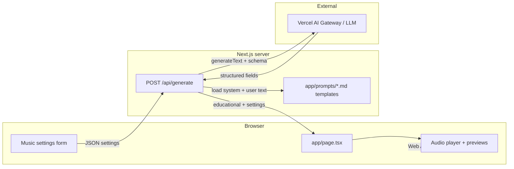

# Architecture — Sonic Scholar

## Overview

Sonic Scholar is a **music education** web app: users configure a synthetic track, request an **AI-generated educational breakdown**, and preview **browser-generated audio** (Web Audio API). The product is optimized for **Vercel** hosting and the **Next.js App Router**.

## Tech stack

| Layer | Technology |
|-------|------------|
| Framework | **Next.js 16** (App Router, Turbopack in dev) |
| Language | **TypeScript** |
| UI | **React 19**, **Tailwind CSS** v4, **Radix UI** primitives |
| AI | **Vercel AI SDK** (`ai` package), `generateText` with **structured output** (Zod). Default model id in code: `openai/gpt-4o-mini` (routed via **Vercel AI Gateway** when deployed). |
| Validation | **Zod** schemas for AI output |
| Analytics | **@vercel/analytics** (production only) |
| Deployment | **Vercel** (recommended) |

### Optional / planned extensions

- **Google Gemini** (or other providers) can replace or complement the current model string once configured in the AI Gateway or SDK; no Gemini-specific code exists in the repository today.
- **Persistent telemetry** (errors, AI metadata) is described in [GOVERNANCE.md](./GOVERNANCE.md) but not wired to a database yet.

## High-level data flow

1. **Client** collects `MusicSettings` (prompt, mood, instruments, BPM, melody, bassline, drums, excitement, vibe) and `POST`s to `/api/generate`.
2. **Route handler** (`app/api/generate/route.ts`) loads **system** and **user** prompt bodies from **`app/prompts/`**, substitutes variables, and calls **`generateText`** with a Zod-backed object schema.
3. **Success path:** JSON includes `educational` (five lesson fields) and echoes `settings`.
4. **Failure path:** Gateway/billing errors may return **403**; other errors return **200** with a **deterministic fallback** `educational` object and `warning` (offline-friendly UX).
5. **Audio** is synthesized entirely **client-side** (`lib/soundscape-engine.ts`, `lib/preview-*.ts`); optional **static samples** under `public/assets/audio/` override preview clips when present.

## Key directories

| Path | Role |
|------|------|
| `app/` | Routes, layout, global styles |
| `app/docs/` | Install runbook, architecture, use cases, governance, env example |
| `app/prompts/` | Editable AI system/user templates (loaded by API route) |
| `app/tests/` | Vitest smoke / unit tests |
| `app/api/generate/` | AI generation API |
| `components/` | UI (forms, player, previews) |
| `lib/` | Audio engine, prompt loading, sample map, vibe presets |
| `public/assets/audio/` | Optional preview MP3/WAV (mapped in `lib/audio-sample-map.ts`) |

## Security & boundaries

- **Prompts** are loaded **server-side only** (`fs.readFileSync`); never expose raw system prompts to the client unless intentional.
- User **prompt** text is embedded in the LLM user message; treat as **untrusted** input (see [GOVERNANCE.md](./GOVERNANCE.md)).
